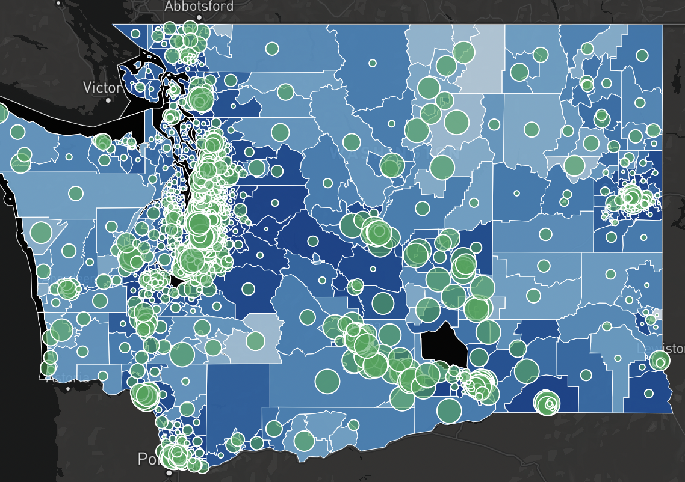
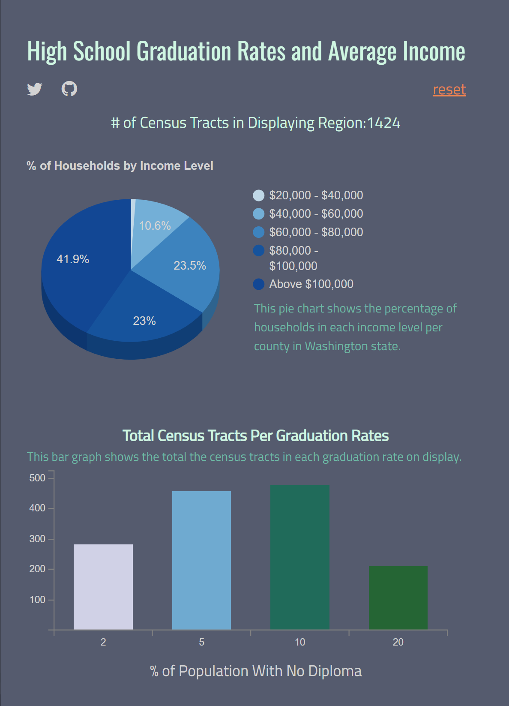

# High School Graduation Rates compared by Mean Household Income

<a href="https://jason-simi.github.io/458_Graduation_Success/index.html"> Project Url </a>

# Team Members
Coby Williams Gurian, Jason Todd, Martin Truong, Camille Zhan

# Project Description 

For our project, we would like to visualize high school graduation rates with average incomes across Washington counties. Free public education is an integral and valuable part of the United States community, and the opportunity to attend school prepares citizens to potentially continue in higher education or enter the professional world. There is a clear correlation between higher average incomes and higher rates of high school graduation, so it is paramount that United States citizens know the importance of graduating high school. To represent income we intend to use proportional symbols on top of a choropleth background for high school graduation rates. We plan to create a smart dashboard that includes an interactive map, information and resources about public education, and an additional chart created from the data. The map will be able to zoom and filter using various interactive elements. We found income data from the US Census: https://data.census.gov/table/ACSST5Y2020.S1902?t=Income%20and%20Poverty&g=040XX00US53$1400000&y=2020,Links to an external site. and high school graduation rate data from the Washington Geospatial Open Data Portal: https://geo.wa.gov/datasets/d4a6f3c1a45d48b9b31de9ebaf5af4ee_0/explore?location=47.237631%2C-120.811974%2C8.00. Links to an external site. The target audience would be current high school students, their parents, and those who would like to see the correlation between high school graduation status and income. Education is incredibly important and it is crucial that people know that in the United States we are blessed to have a free public education system. Especially following the covid-19 pandemic, many students are 'behind grade level' due to gaps in distanced learning.

# Goal

The primary objective of our project is to investigate the relationship between high school graduation rates and mean household income. Specifically, we aim to explore whether there is a correlation between these two variables and to what extent mean household income may affect high school graduation rates.

# Data sources

US Census: https://data.census.gov/table/ACSST5Y2020.S1902?t=Income%20and%20Poverty&g=040XX00US53$1400000&y=2020 
Washington Geospatial Open Data Portal: https://geo.wa.gov/datasets/d4a6f3c1a45d48b9b31de9ebaf5af4ee_0/explore?location=47.237631%2C-120.811974%2C8.00.

# Applied Libraries and Web Services

Libraries Used:

MapboxGL: We utilized the MapboxGL library to create interactive maps that visualize geographical data related to high school graduation rates and mean household income. MapboxGL provided rich mapping capabilities and allowed us to customize map styles, add layers, and incorporate interactive features such as popups and tooltips.

C3.js: To create coordinated visualizations, we employed the C3.js library for generating interactive charts and graphs. C3.js enabled us to create dynamic bar charts that complemented our map visualizations, providing additional insights into the relationship between graduation rates and income levels.

Web Services:

GitHub: We leveraged GitHub as a version control and collaboration platform for our project. GitHub facilitated seamless collaboration among team members, allowing us to share code, track changes, and manage project milestones effectively.

# Acknowledgment

We would like to express our sincere gratitude to Professor Zhao and teaching assistant Liz Peng for their invaluable guidance, mentorship, and support throughout this project.

Special thanks to Washington Geo Sptatial Portal and US Census Bureau for providing access to the datasets used in this project.

